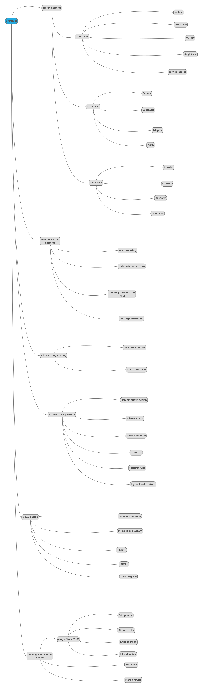

Software architect roadmap 
==========================
In general software architect is like the architect in real-life. 
Hes's responsible for making high-level design decisions. 

### Objective :triangular_flag_on_post:
The objective of this document is giving an overview about the skills required by software engineers to level up and become a software architect.
Still there's no ideal skills required to be gained, but this is just a roadmap to be followed to highlight the main skills to be gained.

Let's define the 3 categories of software architects

### Solutions architect [very detailed architect]
Solution architect is mainly the one responsible for translating requirements into code. 
Sometimes we can call him the "project development team lead" for a specific project.
He's responsible for the following:
- Guiding the development team through the implementation process in every technical details.
- Making sure that the developed solution meets the designed architecture.
- Making sure that the developed solution meets the functional requirements.
- Participate in choosing the right design patterns for solving problems.

Solution architect would be guided by the "Enterprise architect".

### Application architect
Application architect is the one responsible for the following: 
- Choosing the technologies that will be used to implement the application. He'll be 
- Making sure that the team is meeting the standard of the technology used.
- Responsible for choosing and cooperate in developing packages/frameworks that will be used by the team.
- Reliability and scalability of the application.
- Maintaining/refining the development life cycle of the application.

Sometimes they choose one of the development team to be the application architect.

### Enterprise architect [highly abstracted architect]
Enterprise architect is the very highly abstracted architect responsible for the following:
- Designing the high level organizational development process.
- Designing UML that will be used by application/solution architects.
- Should be engaged more with the business mission of the company and the IT strategy.
- Raising the skills of the development team and maintaining their knowledge.

## Contribution :muscle:
- This project is created by [Draw.io](https://draw.io/) so for contribution just download the [map.xml](files/map.xml) import it, edit it and update the exported images in `images/map.png`
- If you want to discuss any ideas/suggestions just ping me on  or [:email:](mailto:alaa.attya91@gmail.com)